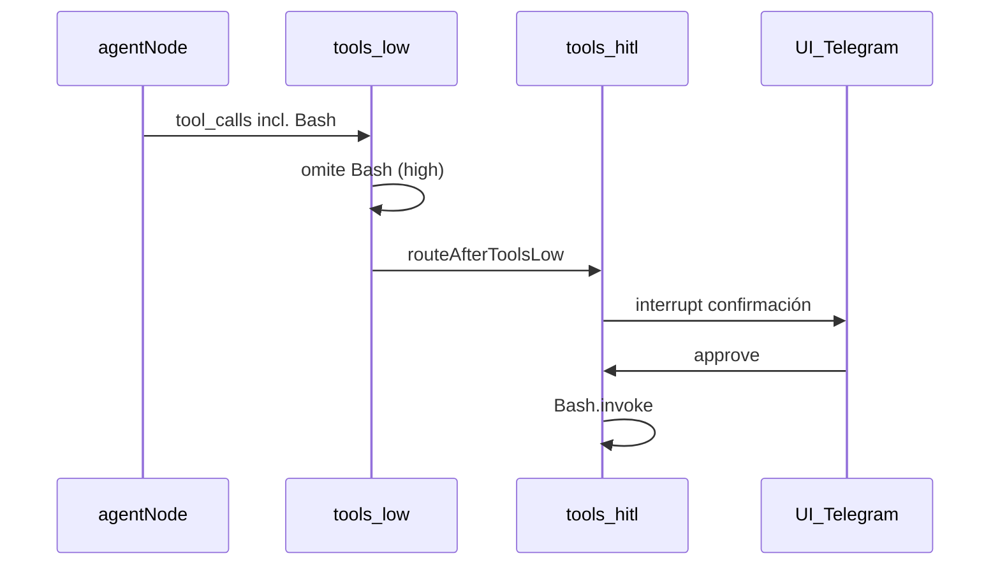

# Plan: herramienta `Bash` (host Node + HITL)

## Contexto del código

- Las herramientas se declaran en [`packages/agent/src/tools/catalog.ts`](packages/agent/src/tools/catalog.ts) y se enlazan en [`packages/agent/src/tools/adapters.ts`](packages/agent/src/tools/adapters.ts) con `@langchain/core/tools` + Zod.
- El **riesgo** se usa en [`packages/agent/src/tools/catalog.ts`](packages/agent/src/tools/catalog.ts) (`toolRequiresConfirmation`): `medium` y `high` exigen HITL. Para `high`, el grafo no ejecuta en `tools_low`; tras aprobación, [`packages/agent/src/graph.ts`](packages/agent/src/graph.ts) (`toolsHitlNode`) llama a `matchingTool.invoke(tc.args)` (mismo patrón que herramientas mutantes no-GitHub).
- Los `tool_id` deben coincidir con el **nombre** que ve el modelo, porque `getToolRisk` y el HITL usan `tc.name` del mensaje del modelo. Por tanto el id del catálogo y el `name` de LangChain serán **`Bash`** (como pediste).

## Semántica de `terminal` y `prompt`

- **`prompt`**: comando o script bash a ejecutar (se pasará a `bash -lc` vía `spawn` con argumentos, no concatenando en un shell intermedio).
- **`terminal`**: identificador lógico de “sesión” para elegir **directorio de trabajo** (no hay PTY persistente en esta fase): cada invocación es un proceso nuevo, coherente con despliegues serverless y con tu elección de ejecutar en el host del backend.

Resolución de `cwd` (orden recomendado):

1. `config_json.terminals[terminal].cwd` del registro `user_tool_settings` con `tool_id === "Bash"` (si existe).
2. Si no hay entrada para ese `terminal`, `config_json.default_cwd`.
3. Variable de entorno `BASH_TOOL_DEFAULT_CWD` (opcional).
4. Fallback: `process.cwd()` del proceso Node.

Documentar en [`.env.example`](.env.example) estas variables y que, en producción en la nube, los comandos corren **en el servidor**, no en el Mac del usuario.

## Implementación técnica

1. **Nuevo módulo** [`packages/agent/src/tools/execute-bash.ts`](packages/agent/src/tools/execute-bash.ts) (o nombre equivalente):
   - `export function executeBash(args: { prompt: string; cwd: string; timeoutMs: number; maxOutputChars: number }): Promise<string>`
   - Usar `child_process.spawn("bash", ["-lc", prompt], { cwd, env: process.env })` con promesa + timeout (`AbortController` + `kill`).
   - Combinar stdout/stderr en la salida devuelta (p. ej. prefijos `stdout:` / `stderr:` o un JSON `{ stdout, stderr, exitCode }` como string — alinear con el estilo de otras tools que devuelven JSON).
   - **Apagado por entorno:** `BASH_TOOL_DISABLED=1` desactiva Bash para todo el despliegue (no se registra el tool en LangChain; `executeBash` devuelve error si se llamara). Complementa el toggle por usuario en `user_tool_settings`.

2. **Catálogo** [`packages/agent/src/tools/catalog.ts`](packages/agent/src/tools/catalog.ts):
   - Entrada `id` / `name`: `Bash`, `risk: "high"`, descripción la que indicaste (ajustada a inglés o bilingüe según el resto del catálogo actual).
   - `parameters_schema` con `terminal` y `prompt` (strings requeridos).

3. **Adapter** [`packages/agent/src/tools/adapters.ts`](packages/agent/src/tools/adapters.ts):
   - Si `isToolAvailable("Bash", ctx)` y Bash no está deshabilitada por env (`isBashToolDisabledByEnv`), registrar `tool(...)` con schema Zod `terminal` + `prompt`.
   - Resolver `cwd` con la configuración del `UserToolSetting` para `Bash` y llamar a `executeBash`.
   - No requiere `requires_integration`; `isToolAvailable` sigue igual.

4. **Mensaje HITL** [`packages/agent/src/graph.ts`](packages/agent/src/graph.ts) en `hitlUiMessage`:
   - Rama para `Bash`: mostrar `terminal` y un `prompt` truncado (p. ej. 120 caracteres) para que el usuario sepa qué va a ejecutarse.

5. **UI / onboarding / ajustes** (listas duplicadas hoy en el repo):
   - [`apps/web/src/app/onboarding/steps/step-tools.tsx`](apps/web/src/app/onboarding/steps/step-tools.tsx) — añadir entrada en `AVAILABLE_TOOLS` con `risk: "high"`.
   - [`apps/web/src/app/onboarding/wizard.tsx`](apps/web/src/app/onboarding/wizard.tsx) — incluir `"Bash"` en el array `TOOL_IDS` del `handleFinish`.
   - [`apps/web/src/app/settings/settings-form.tsx`](apps/web/src/app/settings/settings-form.tsx) — incluir `"Bash"` en `TOOL_IDS`.

6. **Export opcional**: si expones utilidades desde [`packages/agent/src/index.ts`](packages/agent/src/index.ts), no es obligatorio salvo que quieras testear desde fuera del paquete.

## Seguridad y operación (sin ampliar alcance)

- La confirmación HITL es la barrera principal; el riesgo sigue siendo alto porque tras aprobar se ejecuta código arbitrario en el host.
- **`BASH_TOOL_DISABLED=1`:** apagado global en el host (infra); útil cuando no debe existir shell aunque un usuario tenga la tool habilitada en Supabase.
- Límites explícitos: **timeout** (p. ej. configurable por `BASH_TOOL_TIMEOUT_MS`, default razonable tipo 60s) y **tope de tamaño** de salida para no tumbar memoria.
- No añadir allowlist de comandos en esta iteración salvo que lo pidas; se puede mencionar como mejora futura.

## Verificación manual sugerida

- Habilitar `Bash` en ajustes, enviar un mensaje que dispare la tool, aprobar en web/Telegram y comprobar salida y `cwd` según `config_json` o `BASH_TOOL_DEFAULT_CWD`.
- Desactivar `Bash` en la UI y comprobar que el agente ya no expone la tool (no aparece en `buildLangChainTools`).
- Con `Bash` habilitado en UI y `BASH_TOOL_DISABLED=1`: el tool no debe registrarse; si se llamara `executeBash`, respuesta JSON de error sin subprocess.
