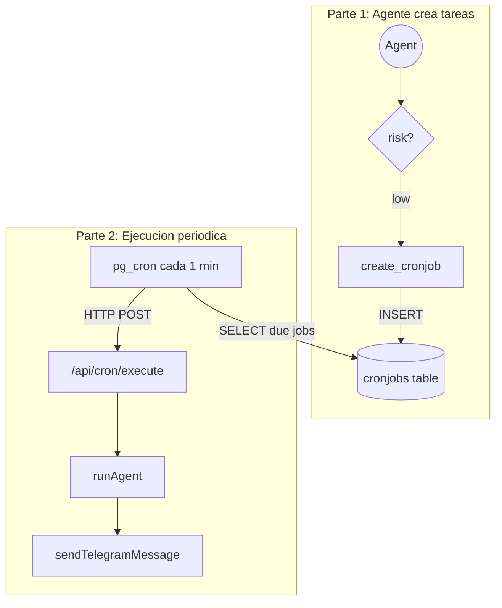
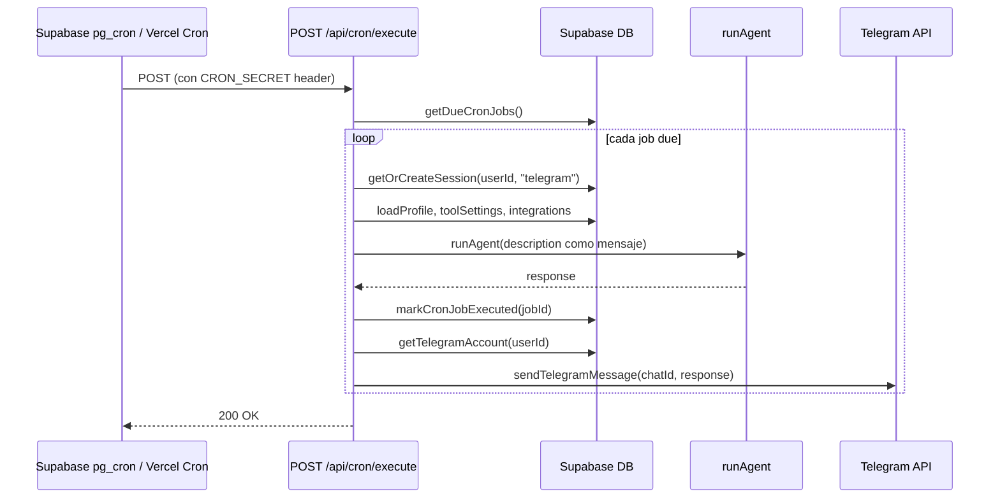

# Tareas Programadas (Scheduled Tasks)

## Arquitectura General

Basado en el diagrama proporcionado, el flujo tiene dos partes independientes:

1. **Parte 1 - El agente crea cronjobs:** El agente usa un nuevo tool `create_cronjob` que inserta registros en una nueva tabla `cronjobs`.
2. **Parte 2 - Supabase Cron ejecuta los jobs:** Un cron job de Supabase (`pg_cron`) lee cada minuto de la tabla `cronjobs`, y llama al agente via HTTP para que ejecute la tarea. El resultado se notifica por Telegram.



---

## 1. Nueva tabla `cronjobs` (Migracion SQL)

Archivo: [`packages/db/supabase/migrations/00003_cronjobs.sql`](packages/db/supabase/migrations/00003_cronjobs.sql)

```sql
create table public.cronjobs (
  id          uuid primary key default uuid_generate_v4(),
  user_id     uuid not null references public.profiles(id) on delete cascade,
  job_name    text not null,
  description text not null default '',
  expression  text not null,            -- cron expression (e.g. "*/30 * * * *")
  enabled     boolean not null default true,
  last_executed_at timestamptz,
  next_run_at timestamptz,              -- precomputed for efficient polling
  created_at  timestamptz not null default now(),
  updated_at  timestamptz not null default now()
);

alter table public.cronjobs enable row level security;

create policy "Users can manage own cronjobs"
  on public.cronjobs for all
  using (auth.uid() = user_id);

-- Index for the cron executor: quickly find jobs that are due
create index idx_cronjobs_next_run on public.cronjobs (next_run_at)
  where enabled = true;
```

Columnas clave:
- `expression`: expresion cron estandar (e.g. `"0 9 * * 1-5"` = lunes a viernes a las 9am)
- `next_run_at`: precalculado al crear/ejecutar para que el poller pueda hacer `WHERE next_run_at <= now() AND enabled = true` sin parsear cron expressions en SQL
- `last_executed_at`: auditoria

---

## 2. Tipos (`@agents/types`)

Archivo: [`packages/types/src/index.ts`](packages/types/src/index.ts) -- agregar:

```typescript
export interface CronJob {
  id: string;
  user_id: string;
  job_name: string;
  description: string;
  expression: string;
  enabled: boolean;
  last_executed_at: string | null;
  next_run_at: string | null;
  created_at: string;
  updated_at: string;
}
```

---

## 3. Queries DB (`@agents/db`)

Nuevo archivo: [`packages/db/src/queries/cronjobs.ts`](packages/db/src/queries/cronjobs.ts)

Funciones a implementar:
- `createCronJob(db, userId, jobName, description, expression)` -- inserta y calcula `next_run_at`
- `getDueCronJobs(db)` -- `SELECT * FROM cronjobs WHERE enabled = true AND next_run_at <= now()`
- `markCronJobExecuted(db, jobId)` -- actualiza `last_executed_at = now()` y recalcula `next_run_at`
- `getUserCronJobs(db, userId)` -- lista los cronjobs de un usuario
- `deleteCronJob(db, jobId)` -- elimina un cronjob
- `updateCronJobEnabled(db, jobId, enabled)` -- habilita/deshabilita

Se necesita una dependencia para parsear cron expressions y calcular `next_run_at`. Usaremos **`cron-parser`** (libreria ligera, bien mantenida).

Exportar desde [`packages/db/src/index.ts`](packages/db/src/index.ts):
```typescript
export * from "./queries/cronjobs";
```

---

## 4. Tool del Agente: `create_cronjob`

### 4a. Catalogo ([`packages/agent/src/tools/catalog.ts`](packages/agent/src/tools/catalog.ts))

Agregar al `TOOL_CATALOG`:

```typescript
{
  id: "create_cronjob",
  name: "create_cronjob",
  description:
    "Creates a scheduled task (cron job) that will run periodically. " +
    "The task description tells the agent what to do on each execution. " +
    "Uses standard cron expressions (e.g. '0 9 * * 1-5' = weekdays at 9am).",
  risk: "low",
  parameters_schema: {
    type: "object",
    properties: {
      job_name: { type: "string", description: "Short name for the task" },
      description: { type: "string", description: "What the agent should do on each run" },
      expression: { type: "string", description: "Cron expression (minute hour day month weekday)" },
    },
    required: ["job_name", "description", "expression"],
  },
},
```

Risk `low` porque solo inserta un registro en la DB; la ejecucion real ocurre despues via el cron executor.

### 4b. Adapter ([`packages/agent/src/tools/adapters.ts`](packages/agent/src/tools/adapters.ts))

Agregar el tool handler que:
1. Valida la expresion cron con `cron-parser`
2. Llama `createCronJob(db, userId, jobName, description, expression)`
3. Retorna confirmacion con `next_run_at`

---

## 5. API Endpoint: Cron Executor

Nuevo archivo: [`apps/web/src/app/api/cron/execute/route.ts`](apps/web/src/app/api/cron/execute/route.ts)

Este endpoint sera llamado por Supabase cron (o Vercel cron, o un cron externo) cada minuto.



Detalles de seguridad:
- Proteger con header `CRON_SECRET` (nueva env var) -- rechazar si no coincide
- Usar `createServerClient()` (service role, bypass RLS)
- `maxDuration = 60` para Vercel

Logica del endpoint:
1. Validar `CRON_SECRET`
2. `getDueCronJobs()` -- obtener jobs cuyo `next_run_at <= now()`
3. Para cada job:
   - Obtener/crear session con `channel: "telegram"`
   - Cargar perfil, tool settings, integraciones
   - Llamar `runAgent({ message: job.description, ... })`
   - `markCronJobExecuted(jobId)` -- actualiza timestamps
   - Buscar `telegram_accounts` del user; si existe, enviar respuesta via Telegram
   - Si no tiene Telegram vinculado, loguear warning (la notificacion se pierde)

---

## 6. Notificacion por Telegram

Se reutiliza la funcion `sendTelegramMessage` que ya existe en el webhook de Telegram. Para evitar duplicacion, se extraera a un modulo compartido:

Nuevo archivo: [`apps/web/src/lib/telegram/send-message.ts`](apps/web/src/lib/telegram/send-message.ts)

Mover la funcion `sendTelegramMessage` del webhook a este archivo y re-importarla en ambos:
- `apps/web/src/app/api/telegram/webhook/route.ts`
- `apps/web/src/app/api/cron/execute/route.ts`

El mensaje enviado tendra formato:
```
[Tarea programada] {job_name}
{agent_response}
```

---

## 7. Mecanismo de invocacion periodica

Hay dos opciones para invocar `/api/cron/execute` cada minuto:

**Opcion A -- Supabase `pg_cron` + `pg_net` (como en el diagrama):**
```sql
-- En la migracion, habilitar las extensiones
create extension if not exists pg_cron;
create extension if not exists pg_net;

-- Registrar el cron job
select cron.schedule(
  'execute-agent-cronjobs',
  '* * * * *',
  $$
  select net.http_post(
    url := 'https://<APP_URL>/api/cron/execute',
    headers := jsonb_build_object(
      'Content-Type', 'application/json',
      'x-cron-secret', '<CRON_SECRET>'
    ),
    body := '{}'::jsonb
  );
  $$
);
```

Nota: `pg_cron` y `pg_net` vienen habilitados en Supabase pero requieren activacion manual desde el dashboard. La URL y el secreto se configurarian manualmente en el SQL (o via Supabase dashboard cron jobs). Este SQL **no** iria en las migraciones automaticas sino como documentacion/setup manual.

**Opcion B -- Vercel Cron (alternativa si despliegan en Vercel):**

Agregar a `vercel.json`:
```json
{
  "crons": [
    { "path": "/api/cron/execute", "schedule": "* * * * *" }
  ]
}
```

Recomendacion: Implementar el endpoint protegido por `CRON_SECRET` para que funcione con cualquiera de las dos opciones. Documentar ambas en el README.

---

## 8. Variables de entorno nuevas

En [`.env.example`](.env.example):

```env
# --- Cron executor ---
CRON_SECRET=           # Secret shared between cron trigger and /api/cron/execute
```

---

## 9. Dependencias nuevas

- `cron-parser` en `packages/db` (o `packages/agent`) para parsear expresiones cron y calcular `next_run_at`

---

## Archivos a crear/modificar (resumen)

| Accion | Archivo |
|--------|---------|
| Crear | `packages/db/supabase/migrations/00003_cronjobs.sql` |
| Crear | `packages/db/src/queries/cronjobs.ts` |
| Crear | `apps/web/src/lib/telegram/send-message.ts` |
| Crear | `apps/web/src/app/api/cron/execute/route.ts` |
| Modificar | `packages/types/src/index.ts` (agregar `CronJob`) |
| Modificar | `packages/db/src/index.ts` (exportar queries) |
| Modificar | `packages/agent/src/tools/catalog.ts` (agregar tool) |
| Modificar | `packages/agent/src/tools/adapters.ts` (agregar handler) |
| Modificar | `apps/web/src/app/api/telegram/webhook/route.ts` (usar shared sendTelegramMessage) |
| Modificar | `.env.example` (agregar CRON_SECRET) |
