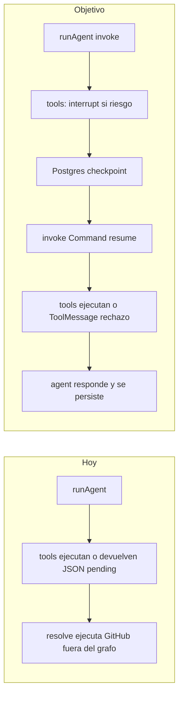

# Plan: HITL con LangGraph (`interrupt` + Postgres) alineado al diagrama

## Brecha respecto al diagrama (estado actual)

- En [`packages/agent/src/graph.ts`](packages/agent/src/graph.ts) el grafo se compila con **`MemorySaver()`** dentro de cada `runAgent()`. Los checkpoints **no sobreviven** a otra petición HTTP, así que **no hay base** para `Command({ resume })` entre clic de aprobar y el siguiente `invoke`.
- La gating de riesgo está en [`packages/agent/src/tools/catalog.ts`](packages/agent/src/tools/catalog.ts) (`toolRequiresConfirmation`) pero la pausa ocurre **dentro** de las herramientas en [`packages/agent/src/tools/adapters.ts`](packages/agent/src/tools/adapters.ts) vía JSON `pending_confirmation` y fila `tool_calls`.
- [`apps/web/src/app/api/tool-calls/[id]/resolve/route.ts`](apps/web/src/app/api/tool-calls/[id]/resolve/route.ts) y el flujo de callback en [`apps/web/src/app/api/telegram/webhook/route.ts`](apps/web/src/app/api/telegram/webhook/route.ts) llaman a **`executeGithubTool` directamente**: el modelo **no recibe** el `ToolMessage` ni continúa el bucle agente → herramientas (comportamiento distinto al diagrama).

## Decisiones de diseño (acotadas al diagrama)

1. **`thread_id`**: seguir usando **`sessionId`** como `configurable.thread_id` (ya está en `graph.ts`), para alinear thread de LangGraph con sesión de negocio.
2. **Dónde poner `interrupt()`**: en el nodo **`tools`** ([`toolExecutorNode`](packages/agent/src/graph.ts)), **antes** de ejecutar herramientas con `toolRequiresConfirmation(toolId)` (riesgo medio/alto según catálogo). El payload debe ser **JSON-serializable** (p. ej. `{ kind, toolName, lcToolCallId, dbToolCallId?, argsSummary, userMessage }`).
3. **Reanudación**: el valor de `Command({ resume })` debe ser lo que `interrupt()` devuelve en el nodo (p. ej. `{ decision: "approve" | "reject" }` o un objeto que incluya `reject` con mensaje opcional). El nodo `tools` **se re-ejecuta desde el inicio** al resumir (comportamiento documentado de LangGraph): mantener el cuerpo del nodo **idempotente** hasta después de `interrupt()` (p. ej. no duplicar `createToolCall` en cada reintento; usar estado ya checkpointado o comprobar si ya existe fila `pending_confirmation` para ese `lcToolCallId`).
4. **Auditoría / auth**: conservar **`tool_calls`** (crear registro `pending_confirmation` con `arguments_json` **antes** del `interrupt`) para que [`resolve`](apps/web/src/app/api/tool-calls/[id]/resolve/route.ts) siga validando usuario/sesión por `id` de fila, y para Telegram (`approve:uuid`). El `resume` puede referenciar ese `id` o inferirse del último interrupt en el hilo.
5. **Postgres checkpointer**: añadir el checkpointer oficial JS compatible con vuestro `@langchain/langgraph` (^0.2) y la guía [Persistence (JS)](https://docs.langchain.com/oss/javascript/langgraph/persistence) / integraciones de checkpointer. Conectar con la **misma URL de Postgres** que ya usa Supabase (variable de entorno dedicada, p. ej. conexión directa o pooler según lo que permita el paquete). Ejecutar migraciones/setup que exija el paquete (tablas de checkpoints).
6. **Compilación del grafo**: evitar compilar un grafo nuevo por petición si complica el ciclo de vida del saver; opciones válidas: **módulo singleton** `getCompiledAgentGraph(checkpointer)` o factory que reutilice una instancia de checkpointer conectada al pool.

## Cambios por capa

### 1) Agente / grafo — [`packages/agent/src/graph.ts`](packages/agent/src/graph.ts)

- Importar **`interrupt`** y **`Command`** desde `@langchain/langgraph`.
- Sustituir `MemorySaver` por **checkpointer Postgres** (instancia compartida).
- Extender la API pública:
  - **`runAgent`**: entrada “nuevo mensaje” → `invoke` con estado inicial (como hoy) **pero** detectar salida con **`__interrupt__`** además de `haltPendingConfirmation`.
  - Nueva función **`resumeAgent(input)`** (o parámetro discriminado en el mismo archivo exportado desde [`packages/agent/src/index.ts`](packages/agent/src/index.ts)): `invoke(new Command({ resume: payload }), { configurable: { thread_id: sessionId } })` sin reinyectar el `HumanMessage` duplicado.
- Ajustar persistencia de mensajes en `runAgent`:
  - Tras **interrupt**: escribir en `agent_messages` una fila (p. ej. `role: assistant`) con **`structured_payload`** describiendo el pendiente (tipo, `tool_call_id` de DB, texto para UI), y `content` legible (resumen). Así [`chat/page.tsx`](apps/web/src/app/chat/page.tsx) puede hidratar el estado al refrescar.
  - Tras **flujo completo** (sin interrupt o después de resume hasta `__end__`): seguir guardando la respuesta final del asistente como hoy.
- **`toolExecutorNode`**: para cada `tool_call` de riesgo ≥ medio, crear `tool_calls` pendiente, llamar `interrupt(...)`, y según el valor retornado tras resume: ejecutar herramienta real (p. ej. `executeGithubTool`) y emitir `ToolMessage`, o emitir `ToolMessage` de rechazo y dejar que el agente continúe.
- Eliminar o reducir la dependencia del JSON `pending_confirmation` devuelto por las tools en [`adapters.ts`](packages/agent/src/tools/adapters.ts) para esas herramientas (la política vive en el nodo + catálogo).

### 2) Herramientas — [`packages/agent/src/tools/adapters.ts`](packages/agent/src/tools/adapters.ts)

- Para `github_create_issue` / `github_create_repo`: opción recomendada — la implementación del `tool` **solo** valida y delega en ejecución cuando el nodo llama a `invoke` tras aprobación (o extraer funciones `runGithubCreateIssue(args)` usadas tanto por el wrapper del tool como por el nodo post-aprobación). Objetivo: **una sola** vía de ejecución mutadora.

### 3) API web

- [`apps/web/src/app/api/chat/route.ts`](apps/web/src/app/api/chat/route.ts): sin cambio conceptual grande si `runAgent` ya devuelve `pendingConfirmation` mapeado desde `__interrupt__` / payload.
- [`apps/web/src/app/api/tool-calls/[id]/resolve/route.ts`](apps/web/src/app/api/tool-calls/[id]/resolve/route.ts): reemplazar la ejecución directa de GitHub por **`resumeAgent`** con el mismo `sessionId` del `tool_call`, pasando decisión approve/reject. Mantener comprobaciones de autorización y estado `pending_confirmation`.
- (Opcional pero limpio) Endpoint dedicado `POST /api/chat/resume` que reciba `{ sessionId, decision }` si preferís no acoplar resume al id de `tool_calls`; el diagrama actual encaja con **reutilizar** `resolve` como entrada de resume.

### 4) UI — [`apps/web/src/app/chat/page.tsx`](apps/web/src/app/chat/page.tsx) y [`chat-interface.tsx`](apps/web/src/app/chat/chat-interface.tsx)

- Incluir `structured_payload` en el `select` de mensajes y, al montar, reconstruir `pending` si el último mensaje estructurado indica HITL abierto **y** el servidor confirma que el thread sigue interrumpido (o confiar en payload + TTL suave; lo más robusto es consultar estado del grafo o una convención de “pending” en DB alineada con `tool_calls.status`).
- Tras approve/reject, si el flujo devuelve respuesta del agente, añadir mensaje asistente a la lista (hoy solo se añade texto estático en el cliente).

### 5) Telegram — [`apps/web/src/app/api/telegram/webhook/route.ts`](apps/web/src/app/api/telegram/webhook/route.ts)

- En `approve`/`reject`, en lugar de `executeGithubTool`, invocar la misma capa **`resumeAgent`** que la web, luego formatear respuesta (reutilizar lógica de mensajes o lo que devuelva `runAgent`/`resumeAgent`).

### 6) Configuración y despliegue

- [`.env.example`](.env.example) / docs: URL Postgres para checkpoints, flags si hace falta SSL.
- Documentar en [`README.md`](README.md) o arquitectura interna: orden **invoke → interrupt → resume** y requisito de **mismo `thread_id`** que `sessionId`.

## Riesgos y mitigaciones

- **Re-ejecución del nodo al resumir**: encapsular “antes de interrupt” (creación de `tool_calls`) con guardas idempotentes.
- **Concurrencia**: dos aprobaciones simultáneas sobre el mismo thread; usar estado `tool_calls` y transacciones `update ... where status = pending_confirmation`.
- **Compatibilidad de paquete**: validar en implementación la versión exacta del checkpointer Postgres para `@langchain/langgraph@0.2.x`.

## Criterios de aceptación

- Tras una herramienta de riesgo medio, la primera respuesta HTTP incluye pendiente y en DB existe **`structured_payload`** recuperable al refrescar.
- Aprobar desde web o Telegram **reanuda el mismo grafo**, ejecuta la herramienta, y el modelo genera una respuesta final persistida en `agent_messages`.
- Rechazar inyecta feedback vía `ToolMessage` (o equivalente) y el agente responde sin ejecutar la mutación.
