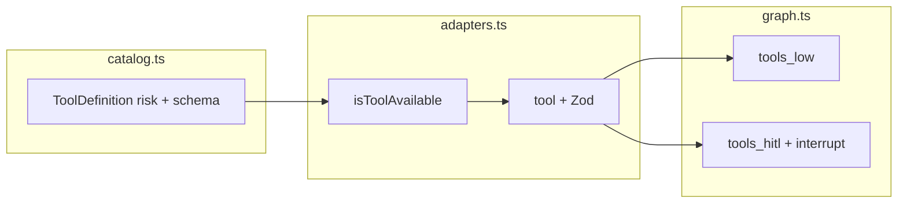

# Plan: tools `read_file`, `write_file`, `edit_file`

## Cómo funciona hoy el catálogo y la ejecución

- **Catálogo** ([`packages/agent/src/tools/catalog.ts`](packages/agent/src/tools/catalog.ts)): cada entrada es un `ToolDefinition` de [`@agents/types`](packages/types/src/index.ts) (`id`, `name`, `description`, `risk`, `parameters_schema`, opcional `requires_integration`). El **`id` y el `name` deben coincidir** con el nombre que expone LangChain, porque [`getToolRisk` / `toolRequiresConfirmation`](packages/agent/src/tools/catalog.ts) y el grafo usan `tc.name` del mensaje del modelo.
- **Registro LangChain** ([`packages/agent/src/tools/adapters.ts`](packages/agent/src/tools/adapters.ts)): `buildLangChainTools` construye herramientas con `tool()` de `@langchain/core/tools` y **Zod**; solo se añade la tool si `isToolAvailable(toolId, ctx)` (toggle en `user_tool_settings` + integración si aplica).
- **Riesgo y flujo** ([`packages/agent/src/graph.ts`](packages/agent/src/graph.ts)):
  - **`low`**: se ejecuta en `toolsLowNode` al instante (sin interrupt).
  - **`medium` / `high`**: se omiten en `tools_low` y pasan a `toolsHitlNode`: `interrupt` → usuario aprueba → se ejecuta (las mutaciones de GitHub tienen rama especial con `executeGithubTool`; el resto, p. ej. `Bash`, usa `matchingTool.invoke` tras aprobar).



- **Patrón de salida**: las tools “ricas” devuelven **string JSON** (véase [`execute-bash.ts`](packages/agent/src/tools/execute-bash.ts): objeto con `stdout`/`stderr` o `{ error: "..." }`; GitHub en [`execute-github-tool.ts`](packages/agent/src/tools/execute-github-tool.ts): `{ error }` o `{ message, ... }`). Conviene **un contrato estable por tool** (`ok`, campos de éxito, `error` + `code` en fallo).

- **UI onboarding/ajustes**: hay que registrar los nuevos `tool_id` en [`apps/web/src/app/onboarding/steps/step-tools.tsx`](apps/web/src/app/onboarding/steps/step-tools.tsx) (`AVAILABLE_TOOLS`), [`wizard.tsx`](apps/web/src/app/onboarding/wizard.tsx) y [`settings-form.tsx`](apps/web/src/app/settings/settings-form.tsx) (`TOOL_IDS`), igual que `Bash`.

---

## Decisiones de diseño recomendadas

| Tool | Riesgo | Motivo |
|------|--------|--------|
| `read_file` | **low** | Solo lectura dentro del workspace; encaja en `tools_low` sin fricción. |
| `write_file`, `edit_file` | **high** | Mutan el filesystem del host (misma familia que [`Bash`](packages/agent/src/tools/catalog.ts)); exigen confirmación vía HITL. |

**Raíz de paths (sandbox coherente con Bash):** añadir parámetro obligatorio **`terminal`** (string) en las tres tools y reutilizar la misma lógica que ya existe: [`resolveBashCwd`](packages/agent/src/tools/execute-bash.ts) + `path.resolve` del workspace + comprobación de que la ruta resuelta **permanece bajo ese directorio** (evita `..` y rutas que escapen). Rechazar paths absolutos del usuario o documentar que solo se aceptan relativos al `cwd` del terminal.

**Semántica de `offset` / `limit` en `read_file`:** recomendación **por líneas** (1-based `offset`, número de líneas `limit`), con defaults razonables (p. ej. `offset=1`, `limit` con tope máximo vía env tipo `FILE_TOOLS_MAX_READ_LINES`) y un tope de **caracteres** en el JSON de salida para no tumbar memoria. Si prefieres bytes en lugar de líneas, se puede documentar como variante; líneas suele alinearse mejor con cómo los modelos razonan sobre código.

**`write_file`:** comprobar que el archivo **no existe** (`fs.access` / `stat`); si existe, error explícito (`code: "FILE_ALREADY_EXISTS"`). Crear directorios padre con `fs.mkdir(..., { recursive: true })` o fallar con error claro — conviene **una sola política** (recomendación: crear padres para reducir fricción, documentado en la descripción de la tool).

**`edit_file`:** leer UTF-8, buscar `old_string`; si **0 ocurrencias** → error (`NOT_FOUND`); si **>1** → error (`AMBIGUOUS_MATCH`, sugerir más contexto en `old_string`). Una sola sustitución (comportamiento tipo Cursor). Tras escribir, respuesta explícita (p. ej. `replacements: 1`, tamaño final); **no** devolver el archivo completo si puede ser enorme — opcional `preview` truncado.

**Kill switch (opcional, alineado con Bash):** `FILE_TOOLS_DISABLED=1` para no registrar las tres tools en `buildLangChainTools` y cortar en runtime si se llamara.

**Mensajes HITL** en [`hitlUiMessage`](packages/agent/src/graph.ts): ramas para `write_file` (path + tamaño aproximado de `content`) y `edit_file` (path + preview corto de `old_string`).

---

## Descripciones propuestas (para el modelo y para implementación)

**Idioma:** el resto del catálogo ([`catalog.ts`](packages/agent/src/tools/catalog.ts)) usa **inglés** en `description` para GitHub y `Bash`; abajo van strings en **inglés** listas para `ToolDefinition.description` y para el campo `description` de `tool(...)` en LangChain. Los mensajes de error en runtime pueden seguir en español como en otras tools.

### `read_file`

**Cuándo usarla:** necesitas el contenido textual de un archivo dentro del workspace del usuario (mismo ancla que la herramienta Bash) sin ejecutar shell. Ideal para inspeccionar código, configs o logs antes de proponer cambios.

**Cuándo no usarla:** no sustituye a `write_file` ni `edit_file`; no sirve para rutas fuera del workspace; si el archivo puede ser binario o enorme, asume que la tool puede fallar o truncar según límites documentados en el sistema.

**Proceso (lo que hace la implementación):** (1) Resuelve el directorio raíz del workspace con `terminal` y la misma configuración que Bash (`config_json.terminals`, `default_cwd`, env, `process.cwd()`). (2) Une de forma segura `path` (relativo al workspace; sin salir del directorio raíz). (3) Lee el archivo como texto UTF-8. (4) Si se pasan `offset` y/o `limit`, interpreta **`offset` como número de línea inicial (base 1)** y **`limit` como cantidad máxima de líneas** a devolver desde esa línea; si faltan, aplica defaults documentados en código (p. ej. desde el principio hasta un máximo de líneas). (5) Aplica topes de tamaño de salida si el fragmento supera límites del despliegue.

**Salida esperada (éxito):** JSON con `"ok": true`, ruta resuelta o relativa acordada, metadatos de líneas (`totalLines` en archivo, `startLine`/`endLine` del fragmento), campo `content` con el texto (solo el rango pedido), y si aplica `truncated: true` u otros flags definidos en el contrato.

**Salida esperada (error):** JSON con `"ok": false`, `error` (mensaje legible) y `code` estable (p. ej. `PATH_OUTSIDE_WORKSPACE`, `ENOENT`, `EISDIR`, `FILE_TOO_LARGE`, `BINARY_OR_INVALID_UTF8`).

**Texto propuesto para `description` (catálogo / LangChain):**

```text
Read a text file from the user's workspace on the application host.

When to use: You need to inspect file contents (source, config, docs) under a configured workspace root without running shell commands.

When NOT to use: To create files (use write_file), to modify existing files (use edit_file), or to access paths outside the workspace bound to `terminal`.

Parameters:
- terminal: Logical session id that selects the workspace root (same as the Bash tool: user tool config terminals map, then default_cwd, then env/process cwd).
- path: Relative path from that workspace root. Must stay inside the workspace; path traversal outside the root is rejected.
- offset: Optional. 1-based start line number. If omitted, reading starts at line 1.
- limit: Optional. Maximum number of lines to return starting at offset. If omitted, a safe default and hard caps apply (see deployment limits).

Process: Resolve workspace root → validate and resolve path → read UTF-8 text → return the requested line range.

Success output: JSON string with ok=true, line metadata, and a "content" field with the excerpt.

Failure output: JSON string with ok=false, a clear "error" message, and a stable "code" string.
```

**`parameters_schema` (descripciones cortas por propiedad):**

- `terminal`: Logical terminal id that selects the workspace root (same rules as Bash).
- `path`: File path relative to the workspace root; must not escape the workspace.
- `offset`: Optional 1-based start line (default: first line).
- `limit`: Optional max lines to return (defaults and caps apply).

---

### `write_file`

**Cuándo usarla:** el usuario quiere **crear un archivo nuevo** que aún no existe en el workspace (ruta relativa bajo el `terminal`).

**Cuándo no usarla:** si el archivo ya existe (incluso vacío): usa **`edit_file`** o pide borrado/renombre por otro medio; no uses esta tool para sobrescribir. No uses para rutas fuera del workspace.

**Proceso:** (1) Resuelve workspace con `terminal`. (2) Valida `path`. (3) Si ya existe un archivo en esa ruta → error `FILE_ALREADY_EXISTS` (no sobrescribe). (4) Crea directorios padre si la política es `mkdir -p` (documentar en descripción). (5) Escribe `content` como UTF-8 (o bytes según decisión final; por defecto texto). (6) Requiere **confirmación del usuario** (riesgo alto / HITL) antes de ejecutar en el grafo.

**Salida esperada (éxito):** JSON `ok: true`, ruta, `bytesWritten` (o `charactersWritten` si solo UTF-8).

**Salida esperada (error):** `ok: false`, `error`, `code` (p. ej. `FILE_ALREADY_EXISTS`, `PATH_OUTSIDE_WORKSPACE`, `EACCES`, `ENOSPC`).

**Texto propuesto para `description`:**

```text
Create a NEW file on the application host inside the user's workspace. This tool NEVER overwrites: if the path already exists, it fails with an explicit error.

When to use: The user explicitly wants a new file that does not exist yet, under the workspace root selected by `terminal`.

When NOT to use: If the file may already exist (use edit_file for changes, or read_file first to confirm). Do not use for paths outside the workspace.

Parameters:
- terminal: Same as Bash — selects workspace root.
- path: Relative path from workspace root; must remain inside the workspace.
- content: Full file contents to write (text).

Process: After user confirmation (high risk), resolve workspace → reject if file exists → create parent directories if needed → write file once.

Success output: JSON with ok=true, resolved path, and bytes written.

Failure output: JSON with ok=false, human-readable error, and stable code (e.g. FILE_ALREADY_EXISTS).
```

**`parameters_schema` (propiedades):**

- `terminal`, `path`: Igual criterio que `read_file`.
- `content`: Full text body for the new file.

---

### `edit_file`

**Cuándo usarla:** el archivo **ya existe** y quieres un cambio localizado sustituyendo un fragmento exacto por otro (p. ej. renombrar función, corregir bloque).

**Cuándo no usarla:** para archivos que no existen (usa `write_file` si debe ser creación). No uses si no puedes citar el texto actual con precisión; primero `read_file` el rango relevante. No sustituyas archivos enteros con un solo `old_string` gigante si el modelo puede equivocarse — preferir fragmentos únicos.

**Proceso:** (1) Resuelve workspace y `path`. (2) Lee el archivo UTF-8. (3) Cuenta ocurrencias de `old_string`: **exactamente una** → reemplaza esa única ocurrencia por `new_string` y escribe el archivo; **cero** → error `NOT_FOUND`; **más de una** → error `AMBIGUOUS_MATCH` (el modelo debe ampliar `old_string` con más contexto). (4) Tras confirmación HITL en el grafo.

**Salida esperada (éxito):** JSON `ok: true`, ruta, `replacements: 1`, tamaño final en bytes/caracteres; opcional preview truncado del contexto del cambio (si se implementa).

**Salida esperada (error):** `NOT_FOUND`, `AMBIGUOUS_MATCH`, `ENOENT`, `PATH_OUTSIDE_WORKSPACE`, `EISDIR`, etc.

**Texto propuesto para `description`:**

```text
Edit an EXISTING text file by replacing exactly ONE occurrence of old_string with new_string inside the user's workspace on the application host.

When to use: The file already exists and you have a precise excerpt of its current contents to change.

When NOT to use: To create a new file (use write_file). If you are unsure of the exact current text, call read_file first on the relevant section.

Parameters:
- terminal: Selects workspace root (same as Bash).
- path: Relative path from workspace root; file must exist and must be a regular file.
- old_string: Exact substring to replace; must appear exactly once in the file (otherwise the tool fails with a clear error).
- new_string: Replacement text (may be empty to delete the matched segment).

Process: After user confirmation, resolve path → read file → if zero matches, error; if multiple matches, error; if exactly one match, apply replacement and write back.

Success output: JSON with ok=true, path, replacements=1, and size metadata (full file content is not returned by default to save tokens).

Failure output: JSON with ok=false, error message, and stable code (NOT_FOUND, AMBIGUOUS_MATCH, etc.).
```

**`parameters_schema` (propiedades):**

- `old_string`: Exact literal to find; must occur exactly once.
- `new_string`: Replacement literal (can be empty).

---

### UI en español (onboarding / settings)

Textos cortos para [`step-tools.tsx`](apps/web/src/app/onboarding/steps/step-tools.tsx), alineados con las descripciones anteriores:

- **read_file:** "Lee archivos de texto dentro del workspace configurado (sin shell). Soporta rango por líneas."
- **write_file:** "Crea solo archivos nuevos; si ya existe, falla. Requiere confirmación."
- **edit_file:** "Cambia un archivo existente sustituyendo un texto exacto una sola vez. Requiere confirmación."

---

## Implementación propuesta (archivos)

1. **Nuevo módulo** [`packages/agent/src/tools/filesystem-tools.ts`](packages/agent/src/tools/filesystem-tools.ts) (nombre orientativo):
   - `resolveWorkspacePath(terminal, relativePath, configJson)` → path absoluto seguro o error estructurado.
   - `executeReadFile`, `executeWriteFileNewOnly`, `executeEditFile` → devuelven **objeto** (el adapter hace `JSON.stringify`).
   - Errores: usar `NodeJS.ErrnoException` / mensajes en español coherentes con el resto del repo, más `code` estable (`ENOENT`, `EACCES`, `PATH_OUTSIDE_WORKSPACE`, etc.).

2. **[`packages/agent/src/tools/catalog.ts`](packages/agent/src/tools/catalog.ts):** tres entradas con `parameters_schema` alineado con lo que valide Zod (path, offset, limit, content, old_string, new_string, terminal).

3. **[`packages/agent/src/tools/adapters.ts`](packages/agent/src/tools/adapters.ts):** tres bloques `if (isToolAvailable(...) && !isFileToolsDisabledByEnv())` con `tool(...)` y schemas Zod; pasar `config_json` del `UserToolSetting` de **Bash** (mismo mapa `terminals` / `default_cwd`) para no duplicar configuración — o, si prefieres separar, una clave nueva en `config_json` solo para file tools (más trabajo en UI); la opción mínima es **reutilizar la config de `Bash`** y documentarlo en la descripción de las tools.

4. **[`packages/agent/src/graph.ts`](packages/agent/src/graph.ts):** ampliar `hitlUiMessage` para `write_file` y `edit_file`.

5. **Web:** añadir las tres herramientas a las listas citadas arriba (textos en español, riesgo acorde).

6. **[`.env.example`](.env.example):** documentar `FILE_TOOLS_DISABLED`, límites (`FILE_TOOLS_MAX_READ_LINES`, `FILE_TOOLS_MAX_OUTPUT_CHARS` o similar) si los implementas.

7. **Pruebas (recomendado):** tests unitarios del módulo `filesystem-tools` con `fs` en tmpdir (crear/leer/editar, path traversal, archivo existente en write, edición ambigua).

---

## Contrato de salida sugerido (por tool)

- **Éxito común:** `{ "ok": true, ...campos específicos }`
- **Error común:** `{ "ok": false, "error": "mensaje legible", "code": "CONSTANTE" }`

Ejemplos de campos de éxito:

- `read_file`: `path`, `lineCount` o `totalLines`, `startLine`, `endLine`, `content` (fragmento), `truncated?`
- `write_file`: `path`, `bytesWritten`
- `edit_file`: `path`, `replacements`, `sizeBytes` (o similar)

---

## Lo que no hace falte tocar

- No se requiere rama especial en `toolsHitlNode` como GitHub: basta con riesgo `high` y el `invoke` genérico ya existente tras aprobación.
- `createToolCall` en el adapter para lecturas: opcional; el patrón actual de tools `low` no lo usa para todas — se puede dejar fuera del primer PR salvo que quieras auditoría en DB.
