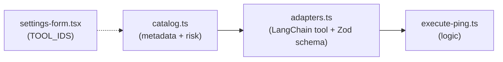

# Create Ping Tool

## Architecture

The tool follows the same 3-layer pattern as the existing tools:



## Files to modify

### 1. New file: [`packages/agent/src/tools/execute-ping.ts`](packages/agent/src/tools/execute-ping.ts)

Module that executes `ping` via `child_process.spawn` and parses the output into a summary. Key decisions:

- Uses `ping -c <count> <destination>` (unix)
- Default count: **4**
- Max count: **20** (prevents abuse)
- Timeout: **30 seconds** hard limit
- Returns a JSON summary: `{ ok, destination, packets_sent, packets_received, packet_loss, rtt_min, rtt_avg, rtt_max, raw_output }`
- Sanitizes `destination` to prevent command injection (only allows valid hostnames/IPs)

```typescript
export async function executePing(args: {
  destination: string;
  count?: number;
}): Promise<string> { ... }
```

### 2. Modify: [`packages/agent/src/tools/catalog.ts`](packages/agent/src/tools/catalog.ts)

Add the `ping` entry to `TOOL_CATALOG` with `risk: "low"`:

```typescript
{
  id: "ping",
  name: "ping",
  description:
    "Sends ICMP ping packets to a destination host or IP to verify network connectivity. " +
    "Returns a summary with packet loss and round-trip time statistics.",
  risk: "low",
  parameters_schema: {
    type: "object",
    properties: {
      destination: { type: "string", description: "Hostname or IP address to ping" },
      count: { type: "number", description: "Number of ping packets to send (default 4, max 20)" },
    },
    required: ["destination"],
  },
}
```

### 3. Modify: [`packages/agent/src/tools/adapters.ts`](packages/agent/src/tools/adapters.ts)

Register the LangChain tool with Zod schema and handler. Since it is `risk: "low"`, it will be routed automatically through `toolsLowNode` in the graph (no confirmation needed, no HITL flow).

```typescript
if (isToolAvailable("ping", ctx)) {
  tools.push(
    tool(
      async (input) => executePing({
        destination: input.destination,
        count: input.count ?? undefined,
      }),
      {
        name: "ping",
        description: "Sends ICMP ping packets to verify network connectivity...",
        schema: z.object({
          destination: z.string().min(1).describe("Hostname or IP address to ping"),
          count: z.number().int().min(1).max(20).optional()
            .describe("Number of packets (default 4, max 20)"),
        }),
      }
    )
  );
}
```

### 4. Modify: [`apps/web/src/app/settings/settings-form.tsx`](apps/web/src/app/settings/settings-form.tsx)

Add `"ping"` to the `TOOL_IDS` array so it appears in the settings UI and can be toggled on/off by the user.

## Security considerations

- **Input sanitization**: `destination` validated with regex (`/^[a-zA-Z0-9._-]+$/`) to prevent shell injection.
- **Count capped** at 20 to prevent resource exhaustion.
- **Spawned directly** via `spawn("ping", ["-c", count, destination])` (no shell interpolation), same secure pattern as `execute-bash.ts`.
- **Hard timeout** of 30s kills the process if it hangs.

## No graph changes needed

Since `risk: "low"`, the existing `toolsLowNode` in [`packages/agent/src/graph.ts`](packages/agent/src/graph.ts) automatically handles execution without confirmation -- no changes to the graph are required.